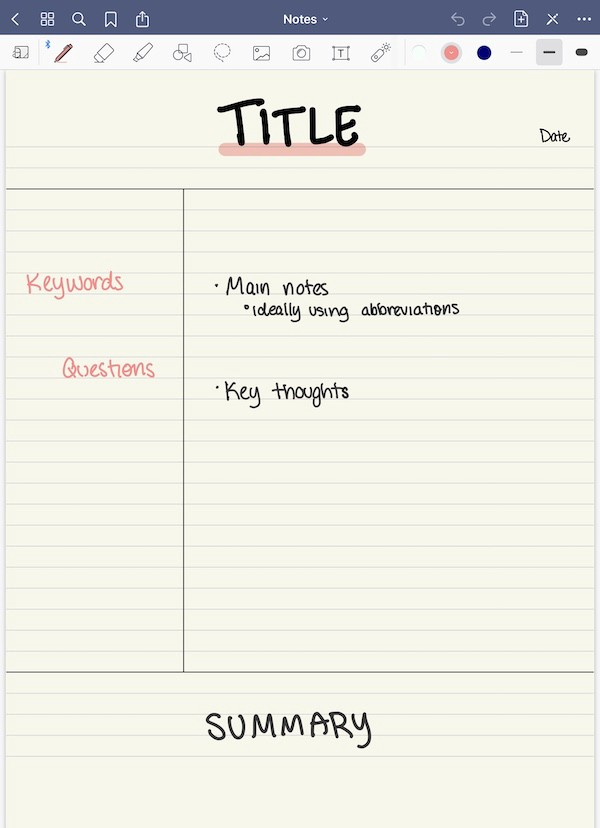
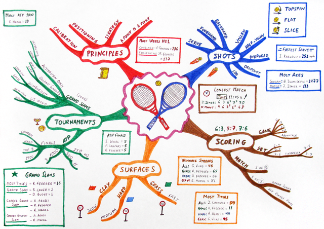
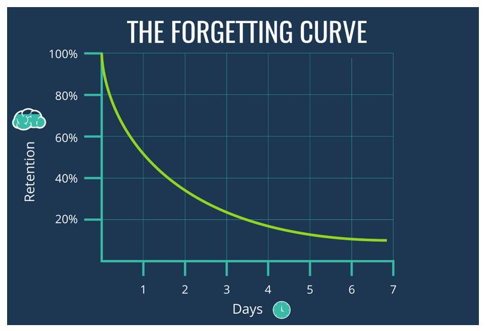
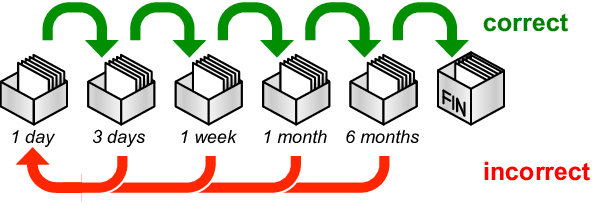
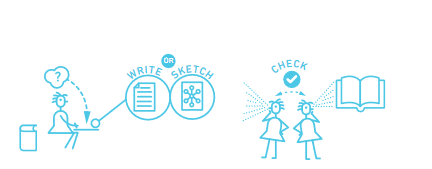
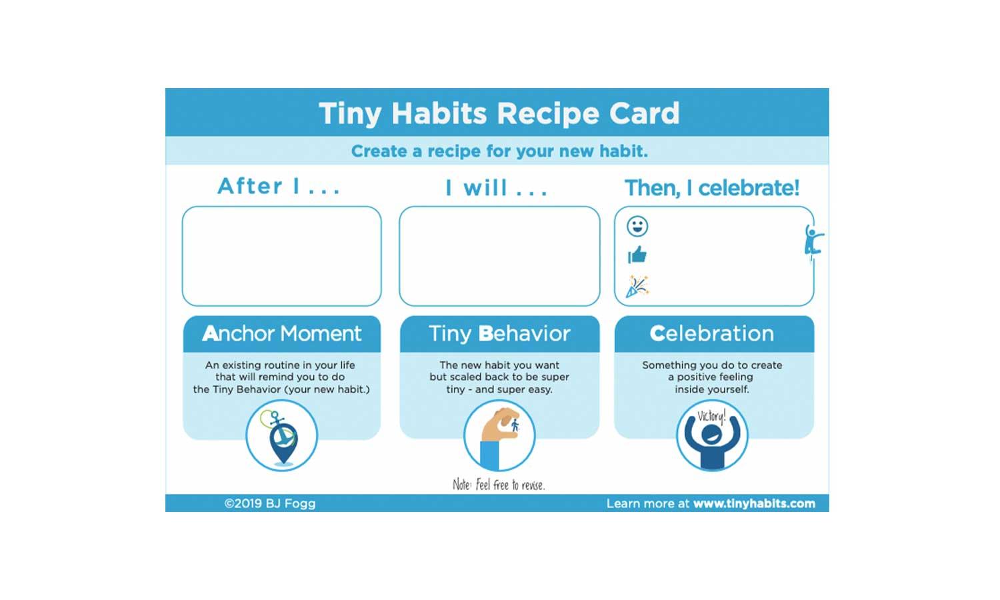

## Table of Contents

1. [Dunning Kruger Effect](#dunning-kruger-effect)
2. [Note Taking](#note-taking)
3. [Forgetting](#forgetting)
4. [Reviewing](#reviewing)
5. [Teaching](#teaching)
6. [Tiny Habits](#tiny-habits)

## Dunning Kruger Effect

The Dunning Kruger effect is a mental situation that happens in the human brain. It's when you are learning something new and you feel really confident, but then later you realize you don't know a lot, and you start to feel very disappointed.

This is very natural. The important thing is to remind yourself, as long as you continue to study you will get better. Your brain might say 'you can't get good at English' but your brain is wrong. And slowly, you will start to feel better about your English skills. 

## Note taking

Note taking is very important. You will not remember everything your teacher says without writing notes!

Make sure to write down any new words or phrases you learn in class!

### How to 'take' notes

There are many ways to take notes. There are four major ways to take notes: The Cornell Method, The Outlining Method, The Mapping Method, and The Charting Method.

Personally, I like The Cornell Method and the Mapping Method.

 
 
 
 

#### The Cornell Method

The Cornell Method splits your page into three spaces. The left space is for new words and questions. The big space is for your main notes (new ideas, new information). The bottom space is for your summary.

In class, you add your main notes and keywords. After class, when you go home, you can summarize (要約) your notes in the Summary area. This will help you review your notes.

#### The Mapping Method

The Mapping Method uses something called 'mind maps'. Mind maps is a visual drawing. You can use an app or pen and paper.

Start with main theme. Make branches for new points. Make more branches on the points for more detail.

## Forgetting

It's easy to forget. Do you remember what you ate on Saturday? When learning new things, like English, it's very easy to forget new words and ideas.

### The Forgetting Curve

The 'curve of forgetting' (忘却曲線) is real. If you don't review, you will forget most of what you learned. 

If you review what you learned, you will 'keep' more new things in your head.

### Reviewing

To stop the 'curve of forgetting', you can review. Reviewing is very important, but how do you review?

#### Using an App (Spaced Repetition) 

There are many apps that can help you review. Many people like _Quizlet_, and a lot of Japanese learners like _anki_ or _ankiapp_. _Anki_ is called a SRS. SRS means Spaced Repetition System (間隔反復システム). Spaced repetition is a time algorithm (アルゴリズム). 

There are many scientific studies that proves SRS is effective.

You can use an SRS app in three steps:

1. Read your notes and find words you want to remember
2. Add a new English word on the 'front' and a Japanese word on the 'back'
3. Continue until you added all the words and phrases

#### Summarizing (要約)

If you prefer writing, you summarize your notes. 

1. Read your notes
2. In a different book, re-write your notes, but use different words and make it shorter
3. Review you new notes every other day

#### Retrieval Practice

Similar to summarizing, but without your notes.

1. Write or sketch (draw a picture) everything you can remember on a sheet of paper
2. After you finish writing everything you can remember, look at your class notes to confirm and correct your points

## Teaching

Another important study tool is teaching. Teaching makes you remember and show all the details of a new word or idea you learned in class. 

You will need another person. It can be anyone, even your mother. 

1. Prepare for your lesson
	- write some notes you will use in 'your lesson'
	- write down any new words or phrases you want to teach
	- write down any examples you want to use
2. Teach your lesson
	- Use a whiteboard or piece of paper to write out the main points of 'your lesson' so 'your student' can understand
	- use your lesson notes if you forget
3. Ask 'your student' for feedback
	- Ask 'your student' if they have any questions
	- Answer their questions 

# Tiny English

## What?

*Tiny Habits* is a book written by BJ Fogg. He has a PHD (a doctor) in psychology (add Japanese here). He has done a lot of research about making new habits and making life easier. 

There are three steps:

1. Trigger - something you
2. Tiny Habit
3.  Reward

For example:
1. Trigger : hang my coat up (when I come home)
2. Tiny Habit: write three new Japanese words in my book
3. Reward: Eat a fruit

### Rewards

Rewards don't always need to be a 'thing' like food. Some rewards can be something you say to yourself ("nice job Justin"), or maybe a smile.

Rewards can also be something fun, like 3 min watching Tik Tok videos. But be careful! It's easy to say '.. just one more minute...'. 

## Task: 

Using the Tiny Habits model, make three new English habits. 

